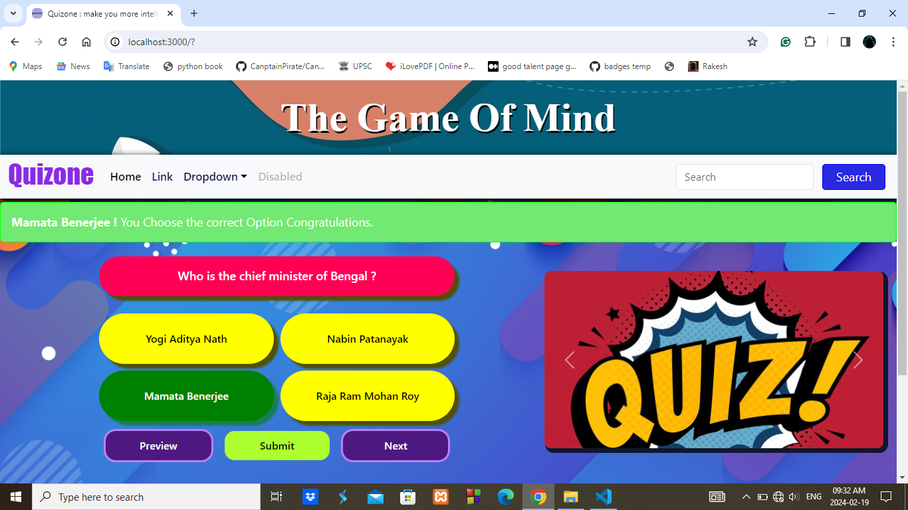

<h1 align="center">Quizone </h1>

**this is a Simple Quiz Game using React-js**

**Using Fetch API**

<a href="#!" align="center">Live site is not available yet .</a>

- Some Key points about this repo:
   - This is a simple quiz website repo
   - If you are reading this, then this site is not responsive yet.
   - it is a very simple and user friendly quiz game
   - Contents of this site is comming from a JSON file using Fetch API.

- If Somebody Wants to contribute some Questions for this site then follow this:
    - Simply **fork** this repo.
    - after forking **clone** to your Local Machine.
    - go to **public > quiz.json** 
    - first understand the basic structure of the file data and then add your Questions
    - **NOTE :** Unnecessary and meaningless and making changes to other folders **(like src, components )** are not allowed to merge

    - At last Create Pull request
